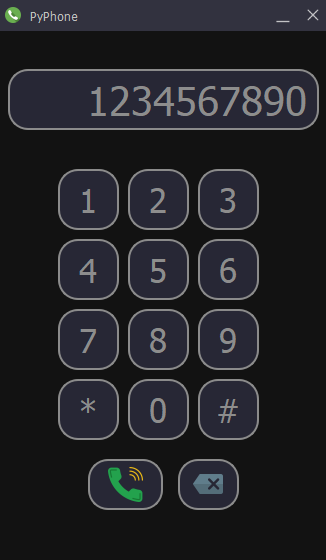
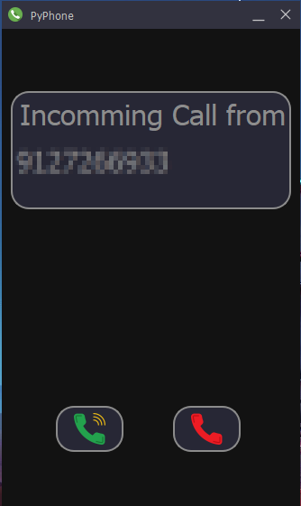
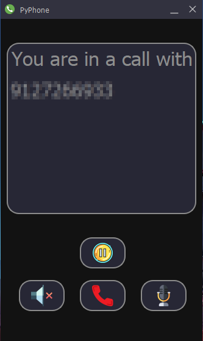

# PyPhone  
Python Based VoIP GUI Calling App  
   
## What is PyPhone?  
  
PyPhone a Python Based GUI VoIP Calling App which enables Calling over the Internet Free of cost. PyPhone currently uses ngrok for port forwarding enabling call from anywhere around the world, with minor changes can be used as a off-grid Calling Service within LAN. It uses PyQt5 for its GUI.   

### Features Expected in Future releases:  
  
1. Multi-User call.  
2. Contact Directory.  
3. Advance Hold Feature.  
  
## How to use PyPhone?  
Since, PyPhone uses ngrok, it is required to make an account in . PyPhone comes with Ngrok.  
### Steps:  
1. Make a file named "ngrok.yml" in the same level as of PyPhone.py and add the following line:  
    authtoken: <YOUR_NGROK_AUTHTOKEN>  
2. "config.cnf" contains the phone number of the user.  
3. Run PyPhone.py  
Also, PyPhone uses MySQL database for storing the phone numbers and requires additional setup.(This step will not be required once PyPhone's MySQL DB is setup)  
### Steps(MySQL DB):
The MySQL requires the following setup:  
pyphone------(Database)  
            ||  
           data-----------------(Table)  
                               ||   
Phoneno varchar(255)|-------------------| Port varchar(6)            
  
## Gallery

